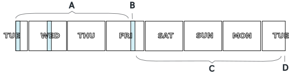

{{'now' | date: '%s' }}
{{ 60 | times: 60 | times: 24 | times: 7 }}
{{ '2021-09-27' | date: '%s'  }}
{{ '2021-10-01' | date: '%s'  }}







<h2>At a glance</h2>

Links to the lecture videos, problem sheets and their solutions will appear here as the unit progresses.  Check <a href="#wbyw">below</a> for the links alongside accompanying information.

 
<table class="pure-table-striped pure-table">
  <!-- <thead>
    <tr> 
      <th>Week</th><th>By</th><th>Theme</th><th>Videos</th><th>Problems</th>
    </tr>
  </thead> -->
  <tbody>
    <tr>
      <td colspan="3" style="text-align:center">Welcome Week</td>
    </tr>
    
    
    <tr>
      <td colspan="3" style="text-align:center"><a href="#week{{ week.num }}">Reading Week</a></td>
    </tr>
    
    <tr>
      <td colspan="3" style="text-align:center; color:grey">-</td>
    </tr>
    
    <tr>
      <td colspan="3" style="text-align:center">Revision Week</td>
    </tr>
    
    {{ week.num | minus: 1 | times: weekunix | plus: startunix }}
    {{ week.num | times: weekunix | plus: startunix }}
    {{ week.num | times: weekunix | plus: startfridayunix }}
    <tr> 
      <td><a href="#week{{ week.num }}">Week {{ week.num }}: {{week.theme}}</a></td>
      <td>
        
          
            <a href="{{ v.url }}" target="_blank">C{{ l.lec }}.{{ part_num }}</a>  // 
          
          
          <a href="{{ week.optional.url }}" target="_blank">S{{ week.num }}</a>
          
        
      </td>
      <td>
        
        <a href="questions/sheet{{ week.num }}.pdf" target="_blank">qns</a>
        
        
         // <a href="answers/sheet{{ week.num }}.pdf" target="_blank">ans</a>
        
      </td>
    </tr>
    
    
  </tbody>
</table>

<h2>Day by day</h2>

  
It is helpful to think of each weeks of this unit as running Tuesday midday until the following Tuesday midday.  The pattern of working described below is recommended.

  

  

    <b style="margin:1em">A</b> Watch the two recorded lectures (typically 4 videos) OR attend the two core lectures (seminar timetable slot); watch the supplementary lecture (video). 
    <b style="margin:1em">B</b> Attend the problem class to discuss solutions to the problems of the <i>previous</i> week. 
    <b style="margin:1em">C</b> Work on the problem sheet for at least 2 hours. 
    <b style="margin:1em">D</b> Submit your answers to the problems to Eddie by midday Tuesday.
  

<h2 id="wbyw">Week by week</h2>




<h3 id="week{{ week.num }}">Week {{ week.num }}: {{ week.theme }}</h3>
<i>{{ week.description | markdownify }}</i>
  <ul>
    {{ week.num | minus: 1 | times: weekunix | plus: startunix }}
    {{ week.num | times: weekunix | plus: startunix }}
    {{ week.num | times: weekunix | plus: startfridayunix }}
    
    <li>
      
Videos:  
      
      - Core Lecture {{ l.lec }}
      
      <ul>
        
          <li>
            <a href="{{ v.url }}" target="_blank">Part {{ part_num }}</a>: {{ v.dsc }} <i>({{ v.len }} mins)</i>
          </li>
          
        
      </ul>
      
      
      - Supplementary
      <ul>
        <li><a href="{{ week.optional.url }}" target="_blank">Part 1</a>: {{ week.optional.dsc }} <i>({{ week.optional.len }} mins)</i>
        </li>
      </ul>
      
      

    </li>
    <li>
      Problems: <a href="questions/sheet{{ week.num }}.pdf" target="_blank">qns</a> / <a href="answers/sheet{{ week.num }}.pdf" target="_blank">ans</a>
    </li>
    <li>
      Slides: 
        
          <a href="slides/P2.pdf" target="_blank">2</a>
           / <a href="slides/P3.pdf" target="_blank">3</a>
            <a href="slides/P4.pdf" target="_blank">4</a>
        
          <a href="slides/P{{ week.num | times: 4 | minus: 3 }}.pdf" target="_blank">{{ week.num | times: 4 | minus: 3 }}</a>
           <a href="slides/P{{ week.num | times: 4 | minus: 2 }}.pdf" target="_blank">{{ week.num | times: 4 | minus: 2 }}</a>
          / <a href="slides/P{{ week.num | times: 4 | minus: 1 }}.pdf" target="_blank">{{ week.num | times: 4 | minus: 1 }}</a>
           <a href="slides/P{{ week.num | times: 4 }}.pdf" target="_blank">{{ week.num | times: 4 }}</a>
        
    </li>
    
  </ul>




  Icons in this course are from the '<a href="https://icons8.com/icons/carbon-copy" target="_blank">Hand Drawn</a>' icon collection by <a href="https://icons8.com/" target="_blank">Icons8</a>.

