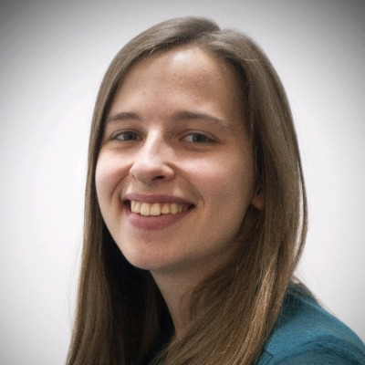

{: .icon }
## Welcome

Welcome to the home of *COMS30040: Types and Lambda Calculus*.  This unit introduces you to the mathematical foundations of programming languages, with an emphasis on functional programs and type systems.  

Our focus will be on the *expressive power* of the language with and without types; the *algorithmics* of assigning types to terms; and the close *correspondence* with logic and proof.  A secondary goal is to teach you to write mathematical proofs.

This unit prepares you for *COMSM0067: Advanced Topics in Programming Languages* in the programming languages theme in your fourth year, but is not a prerequesite.  It shares themes and techniques with the unit *MATH30100: Logic*.

* * *

{: .icon }
## Contacts

The unit is run by Steven Ramsay (lectures), Samantha Frohlich (classes) and Eddie Jones (classes).

{: .invisitable style="margin:2em 0em 0em 2em;"}
| | |  |
| [Steven Ramsay][1] | [Samantha Frohlich][2] | [Eddie Jones][3] |

[1]: https://stersay.github.io
[2]: https://github.com/SamFrohlich
[3]: https://ec-jones.github.io/

Outside of lectures and classes, if you have any questions about the material, the way the unit runs or are just curious about programming language theory or logic more generally, then please post to the General channel of the [Team](https://teams.microsoft.com/l/team/19%3aMxr4W14k819-3_0gY4NZEw7CAgEFr_YhPCedOLdRdIs1%40thread.tacv2/conversations?groupId=a84e471a-ba81-4b8d-bb46-014437171f8d&tenantId=b2e47f30-cd7d-4a4e-a5da-b18cf1a4151b){: target="_blank" }.  We would like to hear from you!

* * *

{: .icon }
## Materials

### Lecture Notes
  The latest version of the lecture notes can be found [here](assets/notes.pdf){: target="_blank" }.

  <table class="pure-table-striped pure-table">
  <thead>
  <tr>
    <th>Date</th><th>Change</th><th>Thanks to</th>
  </tr>
  </thead>
  <tbody>
    <tr><td>27/9</td><td>Added missing defn of subterm to Chapter 3</td><td></td></tr>
  <tr><td>27/9</td><td>Fixed "n+1" should be "n+k" in Table 1.1</td><td>Bradley Phillips</td></tr> 
    <tr><td>29/9</td><td>Revised proof of Lemma 2.2 to follow lecture</td><td></td></tr>
    <tr><td>5/10</td><td>Fixed typos in "What we mean" and FV example </td><td>Bradley Phillips</td></tr>
    <tr><td>8/10</td><td>Fixed missing parens in substitution examples</td><td>Bohan Liu</td></tr>
    <tr><td>11/10</td><td>Reorganised to incorporate an extra lecture spent on reduction</td><td></td></tr>
    <tr><td>16/10</td><td>Moved proof of 7.1 to exercises.</td><td></td></tr>
    <tr><td>17/10</td><td>Fixed typo in first convertibility example.</td><td>Bradley Phillips</td></tr>
    <tr><td>27/10</td><td>Fixed typos in 8.3 example and proof of Thm 8.1.</td><td>Bradley Phillips</td></tr>
    <tr><td>27/10</td><td>Marked (Un)Decidability material non-examinable.</td><td></td></tr>
    <tr><td>02/11</td><td>Revised material on types.</td><td></td></tr>
    <tr><td>02/11</td><td>Added final two chapters.</td><td></td></tr>
  </tbody>
  </table>

### Problem Sheets
  One problem sheet is released each week.  The deadline for marking is end of the day on Tuesday the following week.  Please submit your work to your class tutor (see below) by email with subject "[TLC] Week N", where N is the number of the week containing the deadline, usually this will be the week in which you send the email.

  <table class="pure-table-striped pure-table">
    <thead>
      <tr> 
        <th style="text-align:center">University Week</th>
        <th style="text-align:center">Problems / Solutions</th>
      </tr>
    </thead>
    <tbody>
      <tr>
        <td colspan="2" style="text-align:center">Welcome Week</td>
      </tr>

  
    
  
    
  
  
    <tr>
      <td colspan="2" style="text-align:center">Reading Week</td>
    </tr>
  
    <tr>
      <td colspan="2" style="text-align:center">Coursework Week</td>
    </tr>
  
    <tr>
      <td colspan="2" style="text-align:center">Revision Week</td>
    </tr>
  
    <tr>
      <td style="text-align:center">Week {{ calendar_week }}</td>
      <td style="text-align:center">
    /questions/sheet{{ logical_week }}.pdf
    /answers/sheet{{ logical_week }}.pdf
    
    
    
      
        
      
      
        
      
    
    
        <a href="{{ qns_name | remove_first: "/" }}" target="_blank">qns</a>  
    
    
        / <a href="{{ ans_name | remove_first: "/" }}" target="_blank">ans</a>  
    
      </td>
    </tr>
  

    </tbody>
  </table>

* * *

{: .icon }
## Schedule

You should expect to spend around *6-7 hours per week* working on this unit.

  * __Lectures (2 hr).__ There are two in-person lectures per week, given on campus:
      - Monday at 10am in Queens 1.68
      - Thursday at noon in Queens 1.69
    Each lecture corresponds to one chapter in the lecture notes (see the following).

  * __Reading (0-1 hr).__ You will probably find that you need to revisit the material from the lectures in conjunction with doing the problem sheets.  There is a complete set of [lecture notes](assets/notes.pdf){: target="_blank" } that covers everything to need to know on this unit.  

 
  * __Problem Sheets (2-3 hr).__ You will only learn by completing the problem sheets.  There is one sheet released each week.  You should aim to spend *at least two hours* working on each problem sheet each week, in your own time.  You will need to consult the course [lecture notes](assets/notes.pdf){: target="_blank" } whilst attempting the problems.  You should complete the Week n problem sheet and submit it no later than the end of the (following) Tuesday of Week (n+1).  Submission method to be determined.
  
      Please submit your work by email with subject "[TLC] Week N", where N is the number of the week containing the deadline (usually this will be the current week).  So, the first sheet should be submitted with subject "[TLC] Week 2".  To see who you should submit it to, consult your timetable:

      - If you are in Group 1, please email (a scan/photo/image) to Sam Frohlich (sf16540).
      - If you are in Group 2, please email (a scan/photo/image) to Eddie Jones (ej16147).
    
      *Attempting the problem sheets each week is the single most important thing to do in this unit.  One can certainly excel without watching a single lecture, but not doing the problems will lead to certain disaster.*

  * __Problem Class (1 hr).__ You should attend a problem class each week to discuss the answers to the problems of the previous week.  In Week 1 there you will not have completed a problem sheet yet, but you should still attend the class because we will use the time to teach the last part of our crash course on proof.
     - Friday 3pm in either Ada Lovelace SM3/SM4
   
  * __Office Hours (0-1 hr).__ Steven will be running office hours at a convenient time.

* * *

{: .icon }
## Navigating the course

The unit is distributed over two locations:

* This [blackboard page][bb], which contains:
    - the [welcome page](welcome.html), listing administrative information about the unit
    - the [announcements page](https://www.ole.bris.ac.uk/webapps/blackboard/content/launchLink.jsp?course_id=_252956_1&tool_id=_144_1&tool_type=TOOL&mode=cpview&mode=reset), which should also go to your email address
    - the [lecture notes][rf]{: target="_blank" }, which contains a comprehensive and authoritative reference for all the material in the unit: you will need to refer to this when completing the problems. 

* The [team](https://teams.microsoft.com/l/team/19%3aMxr4W14k819-3_0gY4NZEw7CAgEFr_YhPCedOLdRdIs1%40thread.tacv2/conversations?groupId=a84e471a-ba81-4b8d-bb46-014437171f8d&tenantId=b2e47f30-cd7d-4a4e-a5da-b18cf1a4151b){: target="_blank"} which is where you can post questions about the material, how the unit runs or anything to do with programming language theory or logic and we will do our best to answer them.

[bb]: https://www.ole.bris.ac.uk/webapps/blackboard/execute/content/blankPage?cmd=view&content_id=_7085182_1&course_id=_252956_1
[rf]: assets/notes.pdf

* * *

{: .icon } 
## Assessment

The unit is 100% assessed by a written exam in the January exam period.

A selection of past papers and their answers.  I will try to update these to the 2022 version of the material during the term.



<ul>
  
    
    
    <li><a href="papers/{{ paper_questions_path }}" target="_blank">{{ paper_questions }}</a> (<a href="papers/{{ a.name }}"  target="_blank">answers</a>)</li>
  
</ul>

* * *

{: style="text-align:center"}
Icons in this course are from the '[Hand Drawn](https://icons8.com/icons/carbon-copy)' icon collection by [Icons8](https://icons8.com/).